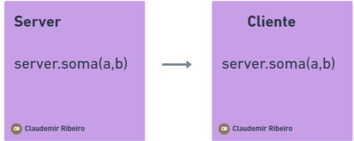

# grpc

## Em quais casos podemos usar?
###
- Ideal para microserviços
- Mobile, Browsers e Backend
- Geração das bibliotecas de forma automática
- Steraming bidirecional utilizando HTTP/2

  # Linguagens (Suporte oficial)
  - gRPC-GO
  - gRPC-JAVA
  - gRPC-C
      - C++
      - Python
      - ...etc

  
  **RPC ilustração**

  

    <ul>
      <li>Item 1</li>
      <li>Item 2</li>
      <li>Item 3</li>
    </ul>
  

  

    <ul>
      <li>Item A</li>
      <li>Item B</li>
      <li>Item C</li>
    </ul>
  

